# Camera Calibration Using Zhang’s Method

This repository provides an end-to-end, from-scratch camera calibration pipeline based on Zhang’s (paper - https://www.microsoft.com/en-us/research/wp-content/uploads/2016/02/tr98-71.pdf) method. The pipeline includes checkerboard detection, homography estimation, intrinsic and extrinsic parameter computation, bundle adjustment, visualization, and comparison with OpenCV’s built-in calibration.

## Results

### Optimized Camera Intrinsics
  
```python
Optimized camera intrinsics (K):
 [[ 2.04853224e+03 -1.83011438e+00  7.58726980e+02]
 [ 0.00000000e+00  2.04074827e+03  1.34514361e+03]
 [ 0.00000000e+00  0.00000000e+00  1.00000000e+00]]
```

### Optimized Camera Extrinsics

```python
Optimized extrinsics for first image (R, t):
 (array([[-0.00355302,  0.99742485,  0.07163125],
       [-0.96149426,  0.01627721, -0.27434258],
       [-0.27480206, -0.06984778,  0.95896043]]),
  array([-1.99555691,  2.34082658, 23.43749701]))
```

### Optimized Distortion Coefficients

```python
Optimized distortion coefficients: [ 0.17310049 -0.75335568]
```


### Checkerboard Corners

<div align="left">
  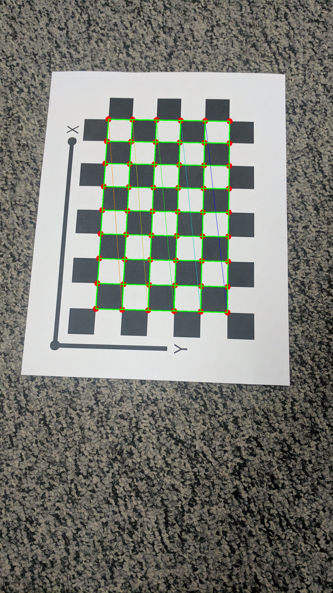
  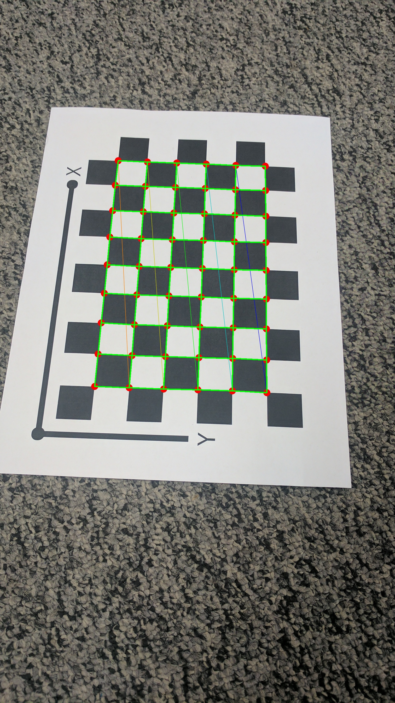
  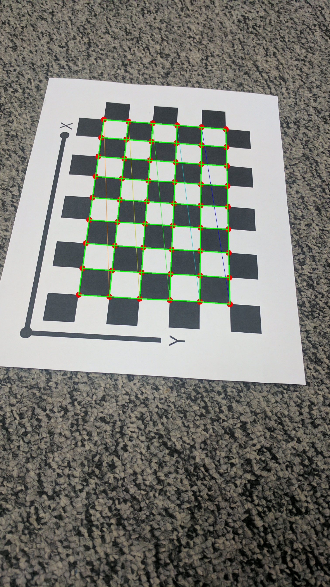
  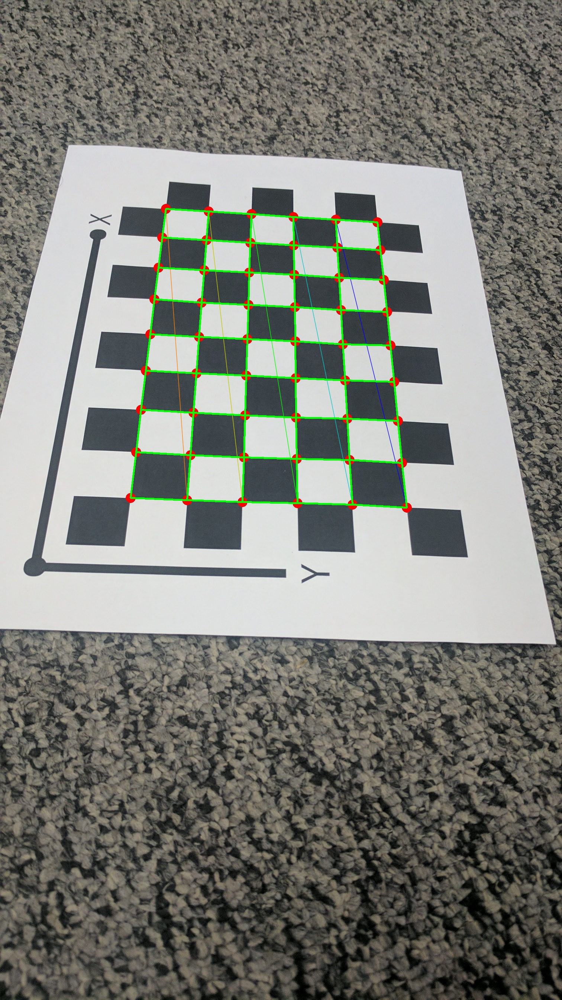
  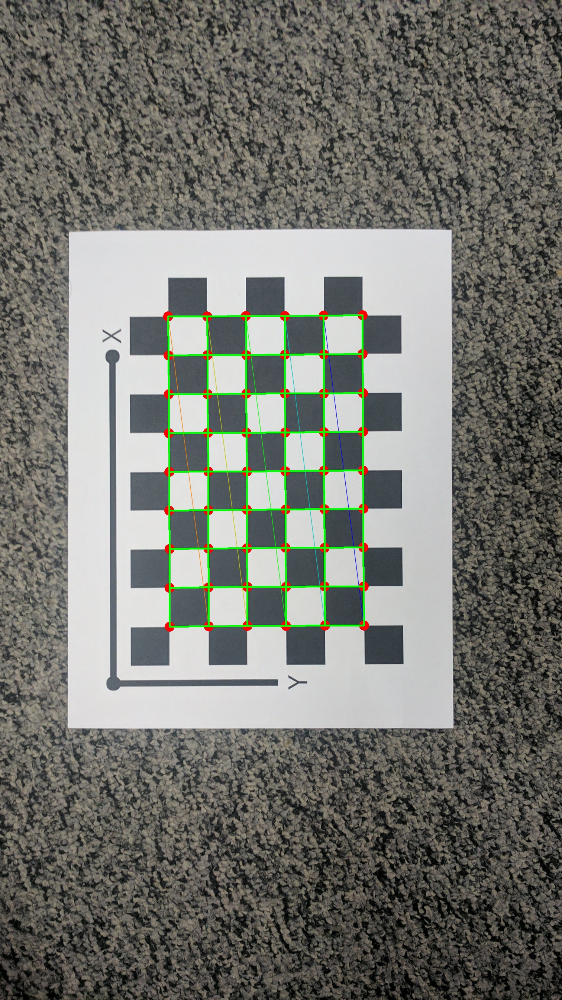
  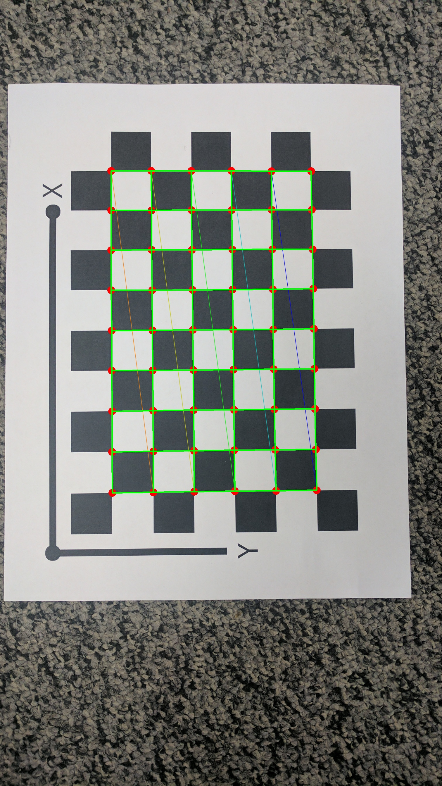
  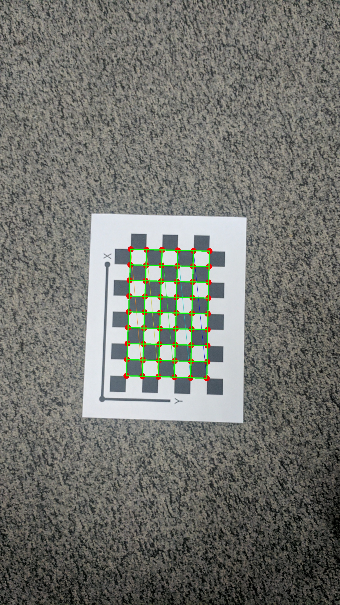
  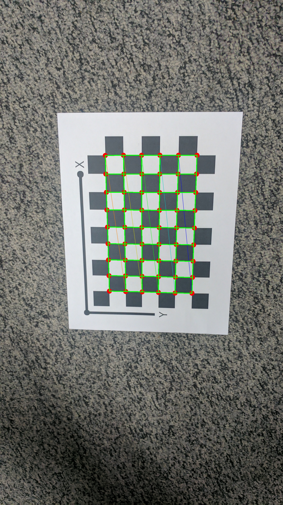
  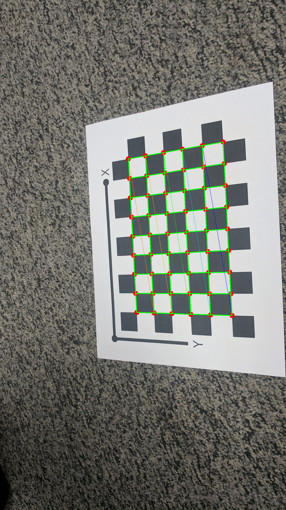
  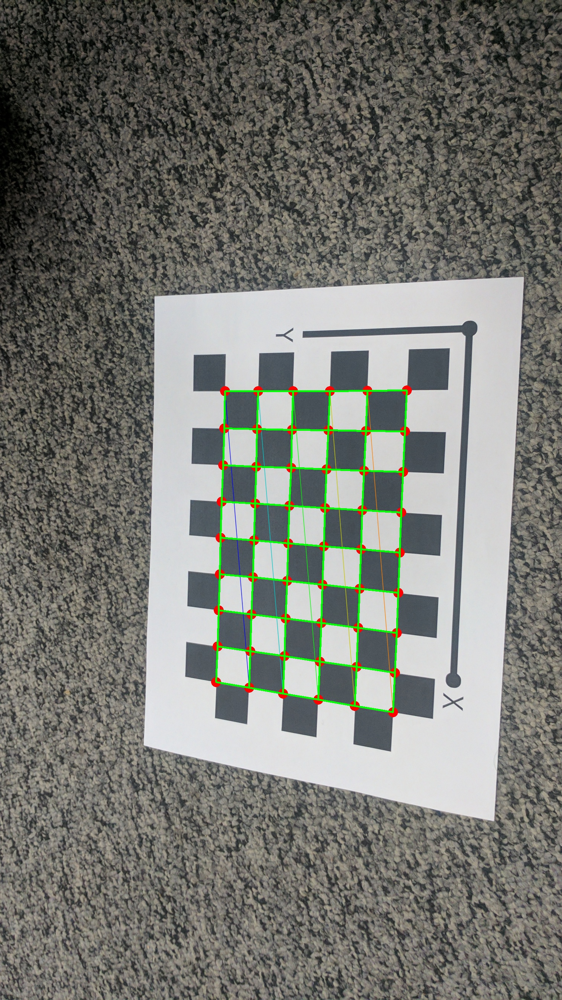
  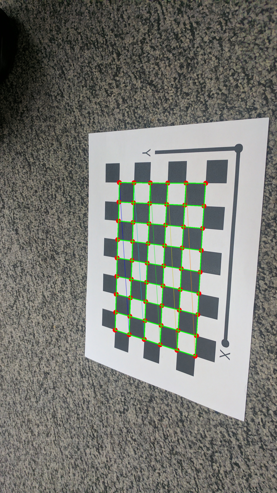
  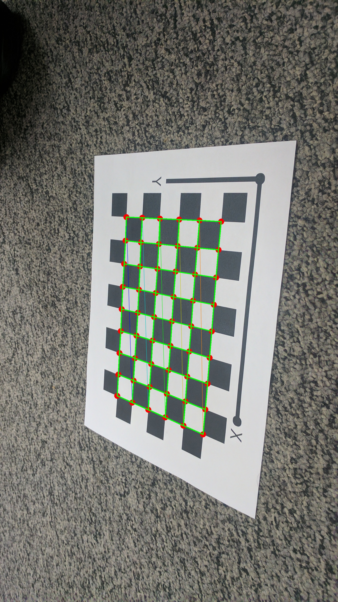
  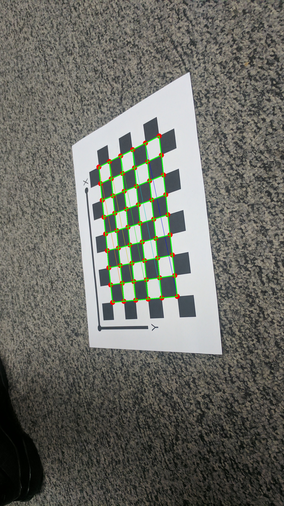
</div>

### Detected vs Reprojected Points

<div align="left">
  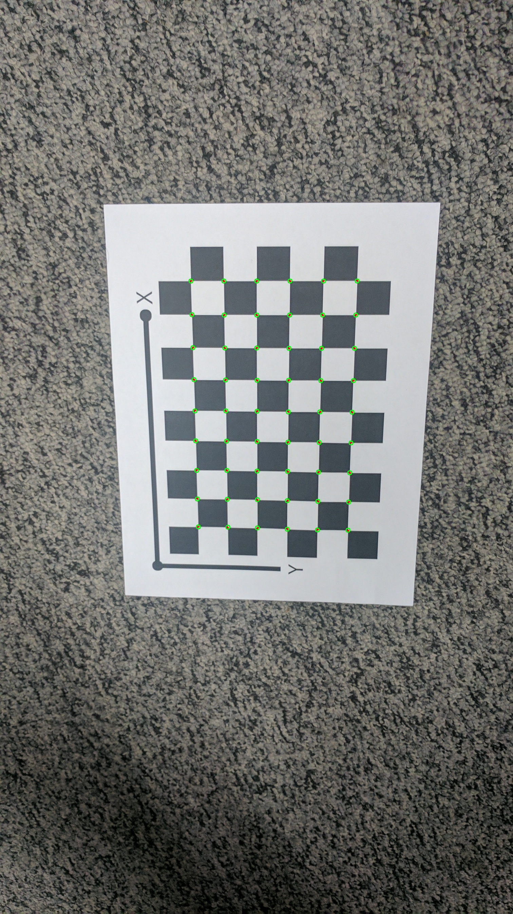
</div>

### Original vs Undistorted Image

<div align="left">
  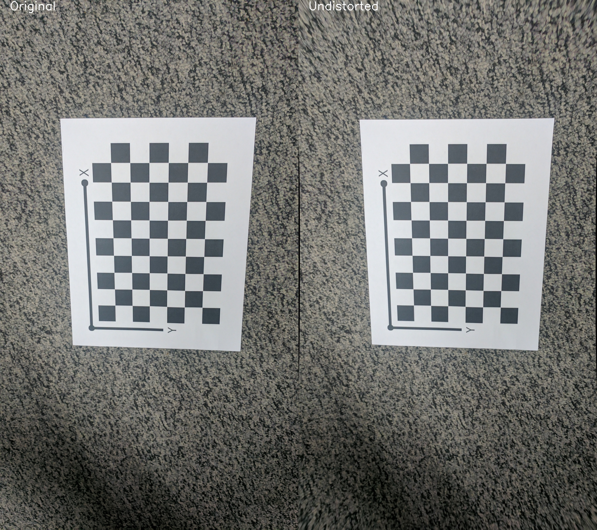
</div>

## Pipeline Overview

1. **Checkerboard Corner Detection**  
   Detect and refine corners in all calibration images.

2. **Object Point Generation**  
   Generate 3D coordinates for checkerboard corners (Z=0 plane).

3. **Homography Estimation**  
   Compute homographies mapping the board to each image.

4. **Intrinsic Matrix Estimation**  
   Solve for the camera’s intrinsic matrix from all homographies.

5. **Extrinsic Parameter Estimation**  
   Recover rotation and translation for each image.

6. **Distortion Initialization**  
   Start with zero radial distortion coefficients (`k1`, `k2`).

7. **Bundle Adjustment**  
   Jointly optimize all parameters to minimize reprojection error.

8. **Result Visualization & Comparison**  
   - Overlay detected and reprojected points.
   - Visualize undistorted images.
   - Compare results with OpenCV’s calibration.

## Usage

1. **Prepare Images**
    - Place all checkerboard images in a folder named `Calibration_Imgs/`.
    - Images should be in `.jpg` format.

2. **Run the Script**
    ```bash
    python main.py
    ```
    - Results and annotated images will be saved to the `Output/` directory.

3. **Check Output**
    - Camera intrinsics, distortion, and extrinsics will be printed.
    - Mean reprojection error is displayed.
    - Visual results are saved for detected vs. reprojected points, and for original vs. undistorted images.

## File Descriptions

| File                                 | Purpose                                                |
|---------------------------------------|--------------------------------------------------------|
| main.py                              | Runs the full calibration pipeline                     |
| detect_checkerboard_corners.py        | Detects and refines checkerboard corners               |
| generate_object_points.py             | Generates and pairs 3D object points                   |
| estimate_homographies.py              | Estimates homographies for each image                  |
| compute_intrinsics.py                 | Computes intrinsic camera matrix                       |
| compute_extrinsics.py                 | Computes rotation and translation for each image       |
| bundle_adjustment.py                  | Performs bundle adjustment (nonlinear optimization)    |
| compute_mean_reprojection_error.py    | Calculates mean reprojection error                     |
| visualize_and_save.py                 | Visualizes and saves images with overlays              |

## Requirements

- Python 3.x
- [NumPy](https://numpy.org/)
- [OpenCV](https://opencv.org/)
- [Matplotlib](https://matplotlib.org/)
- [SciPy](https://scipy.org/)

**Install all dependencies:**
```bash
pip install numpy opencv-python matplotlib scipy
```
